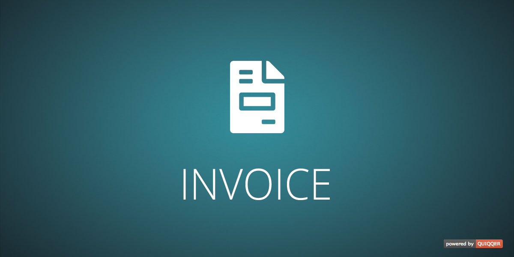

Rechnungsverwaltung
========

Invoice System for QUIQQER

*This package is part of the QUIQQER ERP Stack. 
The QUIQQER ERP Stack is in heavy development and is not yet intended for daily use*

Package name:

    quiqqer/invoice

ERP Stack
----

We recommend to install additional packages:

- quiqqer/erp
- quiqqer/areas
- quiqqer/currency
- quiqqer/discount
- quiqqer/products
- quiqqer/tax

Installation
------------

The package name is: quiqqer/invoice

Server:

- git@dev.quiqqer.com:quiqqer/erp.git
- git@dev.quiqqer.com:quiqqer/invoice.git

Contribution
----------

- Issue Tracker: https://dev.quiqqer.com/quiqqer/invoice/issues
- Source Code: https://dev.quiqqer.com/quiqqer/invoice/tree/master

Support
-------

If you have found an error or want improvements, please send an e-mail to support@pcsg.de.

Licence
-------

- PCSG QEL-1.0

Developer
-------

#### Invoice Events

- onQuiqqerInvoiceCreateCreditNote [Invoice]
- onQuiqqerInvoiceCancel [Invoice]
- onQuiqqerInvoiceStorno [Invoice] (Same as cancel, alias)

- onQuiqqerInvoicePaymentStatusChanged [Invoice, (int) $newStatus, (int) $oldStatus]

- onQuiqqerInvoiceAddComment [Invoice, message]
- onQuiqqerInvoiceAddHistory [Invoice, message]

- onQuiqqerInvoiceCopyBegin [Invoice]
- onQuiqqerInvoiceCopy [Invoice]
- onQuiqqerInvoiceCopyEnd [Invoice, TemporaryInvoice]

- onQuiqqerInvoiceAddPaymentBegin [
    Invoice, 
    $amount, 
    QUI\ERP\Accounting\Payments\Api\PaymentsInterface, 
    $date
]

- onQuiqqerInvoiceAddPayment [
    Invoice, 
    $amount, 
    QUI\ERP\Accounting\Payments\Api\PaymentsInterface, 
    $date
]

- onQuiqqerInvoiceAddPaymentEnd [
    Invoice, 
    $amount, 
    QUI\ERP\Accounting\Payments\Api\PaymentsInterface, 
    $date
]

#### Temporary Invoice Events

- onQuiqqerInvoiceTemporaryInvoicePostBegin [TemporaryInvoice]
- onQuiqqerInvoiceTemporaryInvoicePost [TemporaryInvoice]
- onQuiqqerInvoiceTemporaryInvoicePostEnd [TemporaryInvoice, Invoice]

- onQuiqqerInvoiceTemporaryInvoiceSaveBegin [TemporaryInvoice]
- onQuiqqerInvoiceTemporaryInvoiceSave [TemporaryInvoice]
- onQuiqqerInvoiceTemporaryInvoiceSaveEnd [TemporaryInvoice]

- onQuiqqerInvoiceTemporaryInvoiceCopy [TemporaryInvoice]
- onQuiqqerInvoiceTemporaryInvoiceCopyEnd [TemporaryInvoice, TemporaryInvoice $Copy]

- onQuiqqerInvoiceTemporaryInvoiceDelete [TemporaryInvoice]

- onQuiqqerInvoiceTemporaryInvoiceAddHistory [TemporaryInvoice, message]
- onQuiqqerInvoiceTemporaryInvoiceAddComment [TemporaryInvoice, message]
